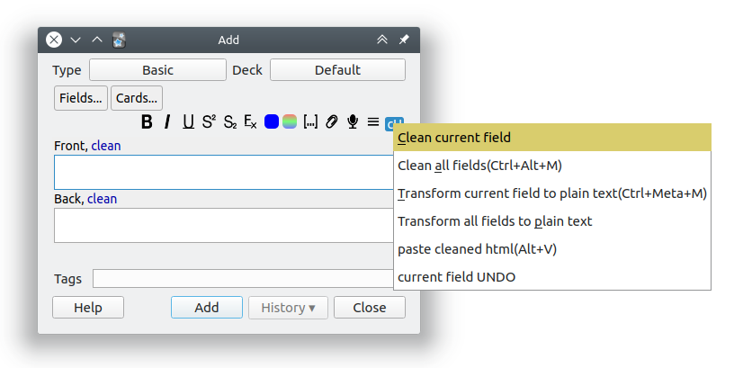

<h2 align="center">HTML Cleaner for Anki</h2>

<!---->
 

> Annoying formatting be gone!

This is an add-on for the spaced-repetition flashcard app [Anki](https://apps.ankiweb.net/) that cleans and minifies the HTML content of the current field, removing extraneous tags and attributes copied over from apps like Word, Chrome, etc.

### Table of Contents <!-- omit in toc -->

<!-- MarkdownTOC levels="1,2,3" -->

- [Installation](#installation)
- [Documentation](#documentation)
- [Building](#building)
- [Contributing](#contributing)
- [License and Credits](#license-and-credits)

<!-- /MarkdownTOC -->

<!-- ### Screenshots

 -->

### Installation

#### AnkiWeb <!-- omit in toc -->

This section will be updated once the add-on is available on AnkiWeb.
<!-- The easiest way to install HTML Cleaner is through [AnkiWeb](https://ankiweb.net/shared/info/ANKIWEB_ID). -->

#### Manual installation <!-- omit in toc -->

Please click on the entry corresponding to your Anki version:

<i>Recent Anki 2.1 versions</i>

 

*Note: These instructions only work on Anki 2.1.17 and up. For older Anki releases please see the next section.*

 

1. Download the latest `.ankiaddon` file from the [releases tab](https://github.com/glutanimate/html-cleaner/releases) (you might need to click on *Assets* below the description to reveal the download links)
2. Open the folder where your downloads are located and double-click on the downloaded `.ankiaddon` file.
3. Follow the installation prompt and restart Anki if it asks you to

<i>Older Anki 2.1 versions</i>

1. Make sure you are [using at least Anki 2.1.10](https://apps.ankiweb.net/#download). Earlier releases (e.g. found in various Linux distros) do not support `.ankiaddon` packages.
2. Download the latest `.ankiaddon` package from the [releases tab](https://github.com/glutanimate/html-cleaner/releases) (you might need to click on *Assets* below the description to reveal the download links)
3. From Anki's main window, head to *Tools* → *Add-ons*
4. Drag-and-drop the `.ankiaddon` package onto the add-ons list
5. Restart Anki

Video summary:

### Documentation

For further information on the use of this add-on please check out [the description text](docs/description.md) for AnkiWeb.

### Building

With [Anki add-on builder](https://github.com/glutanimate/anki-addon-builder/) installed:

    git clone https://github.com/glutanimate/html-cleaner.git
    cd html-cleaner
    aab build

For more information on the build process please refer to [`aab`'s documentation](https://github.com/glutanimate/anki-addon-builder/#usage).

### Contributing

Contributions are welcome! Please review the [contribution guidelines](./CONTRIBUTING.md) on how to:

- Report issues
- File pull requests
- Support the project as a non-developer

### License and Credits

*HTML Cleaner* is 

*Copyright © 2016-2020 [Aristotelis P.](https://glutanimate.com/) (Glutanimate)*

*Copyright © 2020 [Arthur Milchior](arthur@milchior.fr)*

*Copyright © 2020 [ijgnd](https://github.com/ijgnd)*

This add-on was developed on a commission by a fellow Anki user. All credit for the original idea goes to them.

My heartfelt thanks goes out to Arthur and ijgnd for their major contributions in bringing this add-on to Anki 2.1 and extending it with a plethora of new features.

This add-on also would not not have been possible without the following open-source libraries:

- [Bleach](https://github.com/mozilla/bleach) 2.0.0. Copyright (c) 2014-2017 Mozilla Foundation. Licensed under the Apache License 2.0
- [html5lib](https://github.com/html5lib/) 0.999999999. Copyright (c) 2006-2013 James Graham and other contributors. Licensed under the MIT license.
- [htmllaundry](https://github.com/wichert/htmllaundry) 2.1. Copyright (c) 2010-2016 Wichert Akkerman. Licensed under the BSD license.
- [lxml](http://lxml.de/) 3.7.3. Copyright (c) Infrae. Licensed under the BSD license.
- [webencodings](https://github.com/gsnedders/python-webencodings) 0.5.1. Copyright (c) 2012-2017 Geoffrey Sneddon. Licensed under the BSD license.
- [six](https://github.com/benjaminp/six) 1.10.0. Copyright (c) 2010-2015 Benjamin Peterson. Licensed under the MIT license

HTML Cleaner is free and open-source software. The add-on code that runs within Anki is released under the GNU AGPLv3 license, extended by a number of additional terms. For more information please see the [LICENSE](https://github.com/glutanimate/html-cleaner/blob/master/LICENSE) file that accompanied this program.

This program is distributed in the hope that it will be useful, but WITHOUT ANY WARRANTY.

----

<b>

The continued development of this add-on is made possible  thanks to my <a href="https://www.patreon.com/glutanimate">Patreon</a> and <a href="https://ko-fi.com/X8X0L4YV">Ko-Fi</a> supporters.
 You guys rock ❤️ !

</b>